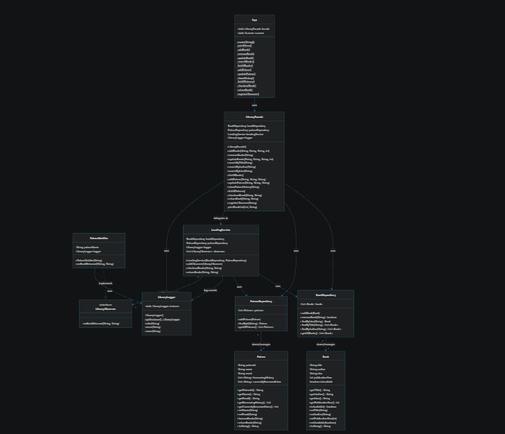

# 📚 Library Management System

A comprehensive **Java-based Library Management System** that demonstrates core software engineering principles and industry-standard design patterns. This system manages book inventory, patron records, and lending operations with event-driven notifications for book availability.

---

## ✨ Project Overview

This Library Management System is designed to provide a complete solution for managing a library's operations including:
- Book catalog management (add, remove, update, search)
- Patron registration and management
- Lending and borrowing operations
- Borrowing history tracking
- Real-time notification system for book availability
- Comprehensive logging of all operations

---

## 🎯 Key Features

### 📖 Book Management
- **Add Books**: Create new book entries with title, author, ISBN, and publication year
- **Remove Books**: Delete books from the inventory by ISBN
- **Update Books**: Modify book information (title, author, publication year)
- **Search Books**: Find books by title, author, or ISBN with partial matching
- **List Books**: Display all books with availability status

### 👥 Patron Management
- **Register Patrons**: Add new library members with ID, name, and email
- **Update Patron Info**: Modify patron details
- **Borrowing History**: Track complete record of books borrowed by each patron
- **List Patrons**: View all registered patrons and their current borrowing status

### 📤 Lending Operations
- **Checkout Books**: Allow patrons to borrow available books
- **Return Books**: Process book returns and update availability
- **Availability Tracking**: Real-time tracking of book availability status
- **Notifications**: Automatic notifications when borrowed books become available

---

## 🏗️ Architecture & Design Patterns

This project implements several industry-standard design patterns:

### 1. **Facade Pattern**
- **Class**: `LibraryFacade`
- **Purpose**: Provides a unified, simplified interface to the complex library system
- **Benefits**: Clients interact with a single facade instead of multiple subsystems

### 2. **Singleton Pattern**
- **Class**: `LibraryLogger`
- **Purpose**: Ensures only one logger instance throughout the entire application
- **Benefits**: Consistent logging across all components

### 3. **Observer Pattern**
- **Interface**: `LibraryObserver`
- **Implementation**: `PatronNotifier`
- **Purpose**: Implements event-driven architecture for notifications
- **Benefits**: Patrons are notified when books they're waiting for become available

### 4. **Repository Pattern**
- **Classes**: `BookRepository`, `PatronRepository`
- **Purpose**: Abstracts data access layer and provides centralized data management
- **Benefits**: Decouples business logic from data access logic

---

## 📁 Folder Structure

```
LibraryMangement/
├── README.md                          # Project documentation
├── bin/                               # Compiled output files
│   └── Entity/
├── lib/                               # External dependencies
├── src/                               # Source code
│   ├── App.java                       # Main application entry point
│   ├── Entity/
│   │   ├── Book.java                  # Book entity class
│   │   ├── Patron.java                # Patron entity class
│   │   └── Repository/
│   │       ├── BookRepository.java    # Book data access layer
│   │       └── PatronRepository.java  # Patron data access layer
│   ├── Logger/
│   │   └── LibraryLogger.java         # Singleton logger utility
│   ├── Observer/
│   │   ├── LibraryObserver.java       # Observer interface
│   │   └── PatronNotifier.java        # Concrete observer implementation
│   └── Service/
│       ├── LendingService.java        # Core lending logic and operations
│       └── LibraryFacade.java         # Main facade orchestrating all services
└── ClassDiagram.png                   # Visual class diagram
```

---

## 🔄 Class Diagram



The class diagram above shows the relationships and dependencies between all classes in the system. It illustrates:
- Entity classes (`Book`, `Patron`) and their associations
- Repository classes managing data access
- Service layer with Facade and Lending operations
- Observer pattern implementation
- Singleton logger usage throughout the system

---

## 📊 Class Details

### Entity Classes

#### `Book.java`
- **Attributes**: title, author, ISBN, publication year, availability status
- **Responsibilities**: Represent a library book with its properties
- **Methods**: Getters/setters for all properties, availability checking

#### `Patron.java`
- **Attributes**: patron ID, name, email, borrowing history, currently borrowed books
- **Responsibilities**: Represent a library patron and track their borrowing activity
- **Methods**: Borrow/return books, access borrowing history

### Repository Classes

#### `BookRepository.java`
- **Responsibilities**: Manage book data persistence
- **Operations**: Add, remove, find (by ISBN/title/author), retrieve all books
- **Data Structure**: ArrayList of Book objects

#### `PatronRepository.java`
- **Responsibilities**: Manage patron data persistence
- **Operations**: Add, find (by ID), retrieve all patrons
- **Data Structure**: ArrayList of Patron objects

### Service Classes

#### `LendingService.java`
- **Responsibilities**: Handle lending and borrowing operations
- **Key Methods**:
  - `checkoutBooks()`: Process book checkout
  - `returnBooks()`: Process book return and notify observers
  - `addObserver()`: Register observers for notifications
- **Dependencies**: BookRepository, PatronRepository, LibraryLogger, Observer list

#### `LibraryFacade.java`
- **Responsibilities**: Orchestrate all library operations
- **Key Methods**: All book management, patron management, and lending operations
- **Dependencies**: BookRepository, PatronRepository, LendingService, LibraryLogger

### Utility Classes

#### `LibraryLogger.java` (Singleton)
- **Responsibilities**: Centralized logging for all operations
- **Methods**: `info()`, `error()`, `warn()`
- **Pattern**: Singleton ensures single instance across the application

### Observer Pattern Classes

#### `LibraryObserver.java` (Interface)
- **Method**: `onBookReturned(String isbn, String bookTitle)`
- **Purpose**: Define contract for observers

#### `PatronNotifier.java` (Implementation)
- **Implements**: LibraryObserver
- **Functionality**: Sends notifications when books become available

### Application Class

#### `App.java`
- **Entry Point**: Contains main() method
- **Responsibilities**: User interface and menu system
- **Operations**: Handles all user inputs and calls facade methods

---

## 🔄 System Workflow

### Book Checkout Flow
1. Patron selects "Checkout Book" from menu
2. Patron provides their ID and book ISBN
3. `LendingService.checkoutBooks()` validates patron and book
4. Book availability is set to false
5. Patron's borrowing record is updated

### Book Return Flow
1. Patron selects "Return Book" from menu
2. Patron provides their ID and book ISBN
3. `LendingService.returnBooks()` validates and processes return
4. Book availability is set to true
5. All registered observers (`PatronNotifier`) are notified
6. Notifications are logged

---

## 🚀 Getting Started

### Prerequisites
- Java Development Kit (JDK) 8 or higher
- VS Code with Java Extension Pack

### Compilation
```bash
javac -d bin src/**/*.java
```

### Running the Application
```bash
java -cp bin App
```

### Menu Options
1. **Add Book** - Add a new book to the library
2. **Remove Book** - Remove a book by ISBN
3. **Update Book** - Update book details
4. **Search Books** - Search by title, author, or ISBN
5. **List All Books** - Display all books with status
6. **Add Patron** - Register a new patron
7. **Update Patron** - Modify patron information
8. **Show Borrowing History** - View patron's borrowing history
9. **List All Patrons** - Display all registered patrons
10. **Checkout Book** - Borrow a book
11. **Return Book** - Return a borrowed book
12. **Register for Notification** - Subscribe to book availability alerts
0. **Exit** - Quit the application

---

## 💡 Design Highlights

- **Decoupled Architecture**: Repositories separate data access from business logic
- **Event-Driven**: Observer pattern enables real-time notifications
- **Centralized Logging**: Singleton logger provides consistent logging
- **User-Friendly**: Intuitive menu-driven interface
- **Scalable**: Easy to extend with new features or observers
- **Maintainable**: Clear separation of concerns and responsibilities

---

## 📝 Requirements Met

✅ Clear and concise README file with comprehensive documentation
✅ Class diagram showing relationships between classes
✅ Complete project structure and folder organization
✅ Design pattern implementation and documentation
✅ Feature overview and workflow explanation
✅ Getting started guide and usage instructions

---

## 📚 Additional Notes

- All operations are logged with appropriate severity levels (INFO, ERROR, WARN)
- The system uses ArrayList for simple in-memory storage
- ISBN must be unique for each book
- Patron IDs must be unique for each patron
- Multiple patrons can register as observers for notifications
- Complete borrowing history is maintained for audit purposes

---

## 🤝 Contributing

This is an assignment project demonstrating design patterns and best practices in Java application development.

## 📄 License

This project is part of the Airtribe Java Assignments.

---

**Version**: 1.0  
**Created**: May 2026  
**Language**: Java  
**Patterns**: Facade, Singleton, Observer, Repository
